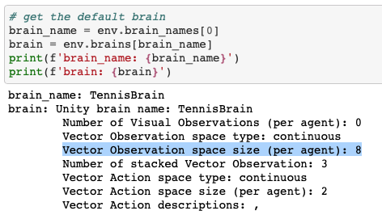
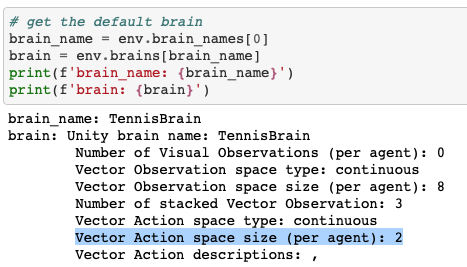

# Deep Reinforcement Learning : Collaboration and Competition

This repository contains my implementation of the [Udacity Deep Reinforcement Learning Nanodegree]((https://www.udacity.com/course/deep-reinforcement-learning-nanodegree--nd893)) Project 3 - Collaboration and Competition

 

## Project's Description  

For this project, you will work with the [Tennis](https://github.com/Unity-Technologies/ml-agents/blob/master/docs/Learning-Environment-Examples.md#tennis) environment.

In this environment, two agents control rackets to bounce a ball over a net. If an agent hits the ball over the net, it receives a reward of +0.1. If an agent lets a ball hit the ground or hits the ball out of bounds, it receives a reward of -0.01. Thus, the goal of each agent is to keep the ball in play.

The observation space consists of 8 variables corresponding to the position and velocity of the ball and racket. Each agent receives its own, local observation. Two continuous actions are available, corresponding to movement toward (or away from) the net, and jumping.

### Rewards

If an agent hits the ball over the net, it receives a reward of +0.1. If an agent lets a ball hit the ground or hits the ball out of bounds, it receives a reward of -0.01.

### Observation Space  

The observation space consists of 8 variables corresponding to the position and velocity of the ball and racket. Each agent receives its own, local observation.

### Actions  

Two **continuous actions** are available, corresponding to movement toward (or away from) the net, and jumping.

### The setting and the goal

The task is episodic, and in order to solve the environment, your agents must get an average score of +0.5 (over 100 consecutive episodes, after taking the maximum over both agents). Specifically,

* After each episode, we add up the rewards that each agent received (without discounting), to get a score for each agent. This yields 2 (potentially different) scores. We then take the maximum of these 2 scores.
* This yields a single score for each episode.

The environment is considered solved, when the average (over 100 episodes) of those scores is at least +0.5.

 

### Note
The project environment is similar to, but not identical to the Tennis environment on the [Unity ML-Agents GitHub page](https://github.com/Unity-Technologies/ml-agents/blob/master/docs/Learning-Environment-Examples.md).

## Getting Started

### The Environment

#### Step 1: Activate the Environment

1. Configure your Python environment by following [instructions in the Udacity DRLND GitHub repository](https://github.com/udacity/deep-reinforcement-learning#dependencies). These instructions can be found in the `Readme.md` at the root of the repository
2. By following the instructions you will have PyTorch, the ML-Agents toolkits, and all the Python packages required to complete the project
3. (For Windows users) The ML-Agents toolkit supports Windows 10. It has not been tested on other versions.

#### Step 2: Download the Unity Environment 

FFor this project, you will **not** need to install Unity - this is because we have already built the environment for you, and you can download it from one of the links below. You need only select the environment that matches your operating system:

Linux: [click here](https://s3-us-west-1.amazonaws.com/udacity-drlnd/P3/Tennis/Tennis_Linux.zip)
Mac OSX: [click here](https://s3-us-west-1.amazonaws.com/udacity-drlnd/P3/Tennis/Tennis.app.zip)
Windows (32-bit): [click here](https://s3-us-west-1.amazonaws.com/udacity-drlnd/P3/Tennis/Tennis_Windows_x86.zip)
Windows (64-bit): [click here](https://s3-us-west-1.amazonaws.com/udacity-drlnd/P3/Tennis/Tennis_Windows_x86_64.zip)
Then, place the file in the `p3_collab-compet/` folder in the DRLND GitHub repository, and unzip (or decompress) the file.

(For Windows users) Check out [this link](https://support.microsoft.com/en-us/help/827218/how-to-determine-whether-a-computer-is-running-a-32-bit-version-or-64) if you need help with determining if your computer is running a 32-bit version or 64-bit version of the Windows operating system.

(For AWS) If you'd like to train the agent on AWS (and have not [enabled a virtual screen](https://github.com/Unity-Technologies/ml-agents/blob/master/docs/Training-on-Amazon-Web-Service.md)), then please use [this link](https://s3-us-west-1.amazonaws.com/udacity-drlnd/P3/Tennis/Tennis_Linux_NoVis.zip) to obtain the "headless" version of the environment. You will **not** be able to watch the agent without enabling a virtual screen, but you will be able to train the agent. (To watch the agent, you should follow the instructions to [enable a virtual screen](https://github.com/Unity-Technologies/ml-agents/blob/master/docs/Training-on-Amazon-Web-Service.md), and then download the environment for the **Linux** operating system above.)

#### Step 3: Explore the Environment

After you have followed the instructions above, open `Tennis_v2.ipynb`  and follow the instructions to learn how to use the Python API to control the agent.

 

## Train a agent

Execute the provided notebook: `Tennis_v2.ipynb`

1. `model.py` implements the Deep Deterministic Polich Gradient (DDPG) Actor and Critic networks. This currently contains fully-connected neural network with ReLU activation. You can change the structure of the neural network and play with it. I used 2 hidden layers, [batch normalization](http://proceedings.mlr.press/v37/ioffe15.pdf), and dropout[1](https://arxiv.org/pdf/1207.0580.pdf)[2](http://www.cs.toronto.edu/~rsalakhu/papers/srivastava14a.pdf) in the both of the Actor and Critic networks.
   > Deep Deterministic Policy Gradient (DDPG) is a model-free off-policy algorithm for learning continous actions. It combines ideas from DPG (Deterministic Policy Gradient) and DQN (Deep Q-Network). It uses Experience Replay and slow-learning target networks from DQN, and it is based on DPG, which can operate over continuous action spaces. [source](https://keras.io/examples/rl/ddpg_pendulum/)

2. `ddpg_agent_v2.py` implementss the Agent, OUNoise, and ReplayBuffer. The Agent has Actor network and Critic network. Actor network proposes an action given an state and Critic network predicts if the action is good or bad given a state and an action. Each Actor and Critic network has local and target network. For continuous action spaces, exploration is done via adding noise to the action and the authors of the paper, [Lillicrap, Timothy P., et al. "Continuous control with deep reinforcement learning." arXiv preprint arXiv:1509.02971 (2015).,](https://arxiv.org/pdf/1509.02971.pdf), used Ornstein-Uhlenbeck process.
   > An advantage of off-policies algorithms such as DDPG is that we can treat the problem of exploration independently from the learning algorithm. We constructed an exploration policy μ′ by adding noise sampled from a noise process N to our actor policy. As detailed in the supplementary materials we used an Ornstein-Uhlenbeck process (Uhlenbeck & Ornstein, 1930) to generate temporally correlated exploration for exploration efficiency in physical control problems with inertia. [Source](https://arxiv.org/pdf/1509.02971.pdf)

    The Agent also uses Experience Replay.  
   > Reinforcement learning algorithms use replay buffers to store trajectories of experience when executing a policy in an environment. During training, replay buffers are queried for a subset of the trajectories (either a sequential subset or a sample) to "replay" the agent's experience. [Source](https://www.tensorflow.org/agents/tutorials/5_replay_buffers_tutorial)

3. `checkpoint_actor.pth` and `checkpoint_critic.pth` are the saved models.
