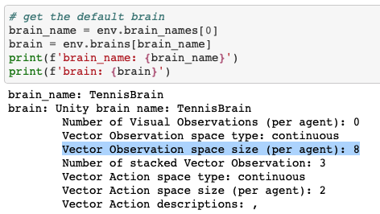
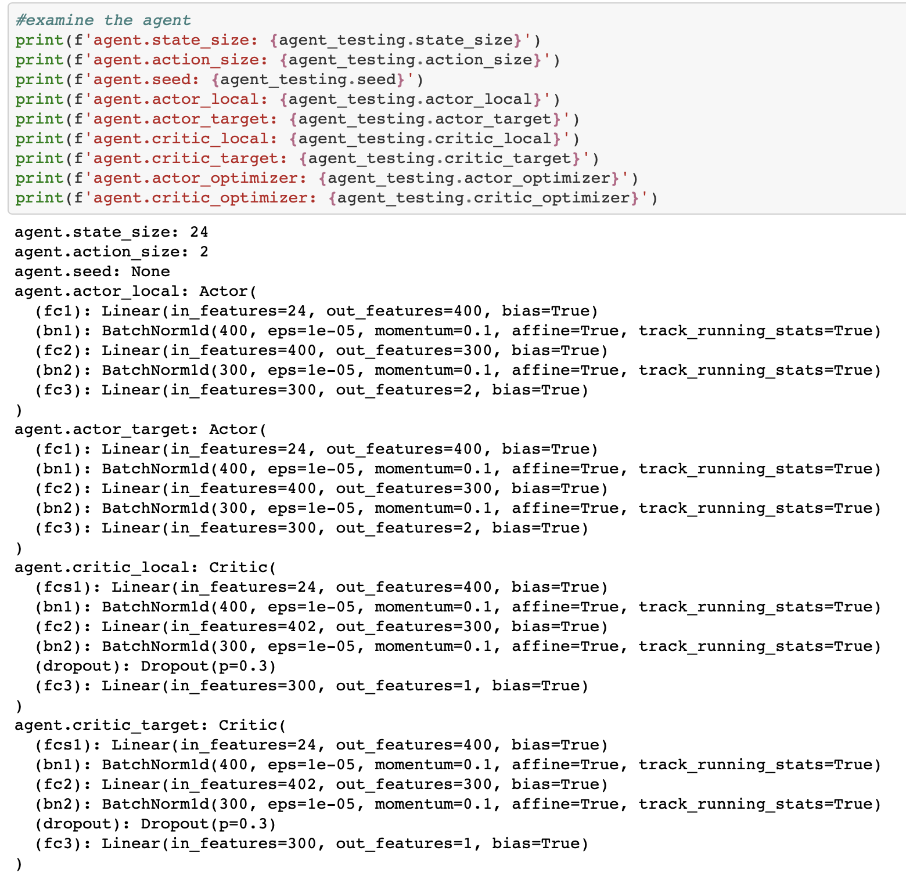

# Deep Reinforcement Learning : Collaboration and Competition

This report contains my implementation of the [Udacity Deep Reinforcement Learning Nanodegree]((https://www.udacity.com/course/deep-reinforcement-learning-nanodegree--nd893)) Project 3 - Collaboration and Competition

## Project's Goal  

For this project, I worked with the [Tennis](https://github.com/Unity-Technologies/ml-agents/blob/master/docs/Learning-Environment-Examples.md#tennis) environment.

IIn this environment, two agents control rackets to bounce a ball over a net. If an agent hits the ball over the net, it receives a reward of `+0.1`. If an agent lets a ball hit the ground or hits the ball out of bounds, it receives a reward of `-0.01`. Thus, the goal of each agent is to keep the ball in play.

### Observation Space  

The observation space consists of `8` variables corresponding to the position and velocity of the ball and racket. Each agent receives its own, local observation.



### Actions  

Two (`2`) **continuous actions** are available, corresponding to movement toward (or away from) the net, and jumping.


### Rewards

If an agent hits the ball over the net, it receives a reward of `+0.1`. If an agent lets a ball hit the ground or hits the ball out of bounds, it receives a reward of `-0.01`.

### The setting and the goal

The task is episodic, and in order to solve the environment, your agents must get an average score of `+0.5` (over `100` consecutive episodes, after taking the maximum over both agents). Specifically,

* After each episode, we add up the rewards that each agent received (without discounting), to get a score for each agent. This yields `2` (potentially different) scores. We then take the maximum of these `2` scores.
* This yields a single score for each episode.

The environment is considered solved, when the average (over `100` episodes) of those scores is at least `+0.5`.

<br>

## Multi-Agent Deep Deterministic Polich Gradient (MADDPG)

As some hints are given, I decided to start with Deep Deterministic Polich Gradient (DDPG) Actor-Critic method to solve this problem. I have an experience to play with DDPG in [my previous DDPG project](https://github.com/DoosanJung/Udacity-deep-reinforcement-learning-nanodegree-continuous-control). DDPG is a model-free, off-policy reinforcement learning that combines [Deterministic Policy Gradient (DPG)](https://hal.inria.fr/file/index/docid/938992/filename/dpg-icml2014.pdf) with [Deep Q-Network (DQN)](https://storage.googleapis.com/deepmind-media/dqn/DQNNaturePaper.pdf). As mentioned in [my previous project](https://github.com/DoosanJung/Udacity-deep-reinforcement-learning-nanodegree-navigation/blob/main/Report.md#deep-q-networks), DQN stabilizes the learning of Q-function by experience replay and the fixed target network. The original DQN works in discrete space, and DDPG extends it to continuous space with the actor-critic framework while learning a deterministic policy.

> Deep Deterministic Policy Gradient (DDPG) is a model-free off-policy algorithm for learning continous actions. It combines ideas from DPG (Deterministic Policy Gradient) and DQN (Deep Q-Network). It uses Experience Replay and slow-learning target networks from DQN, and it is based on DPG, which can operate over continuous action spaces. [source](https://keras.io/examples/rl/ddpg_pendulum/)

For more information, please refer to the paper, [Lillicrap, Timothy P., et al. "Continuous control with deep reinforcement learning." arXiv preprint arXiv:1509.02971 (2015)](https://arxiv.org/pdf/1509.02971.pdf).

> Our contribution here is to provide modifications to DPG, inspired by the success of DQN, which allow it to use neural network function approximators to learn in large state and action spaces online. We refer to our algorithm as Deep DPG (DDPG, Algorithm 1).[source](https://arxiv.org/pdf/1509.02971.pdf)

In the paper mentioned above, they described the algorithm in detail.


<br>

## Algorithm, Approach, and Implementation

### DDPG Algorithm


This screenshot is taken from the [Deep Reinforcement Learning Nanodegree course](https://www.udacity.com/course/deep-reinforcement-learning-nanodegree--nd893)

### My approach

As some hints are given, I decided to start with Deep Deterministic Polich Gradient (DDPG) Actor-Critic method to solve this problem. And, I ended up with the same DDPG Actor-Critic method. The Actor-Critic model is very similar to the one I used in [my previous DDPG project](https://github.com/DoosanJung/Udacity-deep-reinforcement-learning-nanodegree-continuous-control) except that I introduced a dropout layer and changed the sizes of the hidden layers. 

I experienced numerous cases where the agent started learning and, at one point, the score crashes to `0.00` and I found no sign of recovery or learning back.

There are a few points I would like to mention:

* I read the benchmark implementation hint again, especially the below:
  > In our case, each agent used the same actor network to select actions, and the experience was added to a shared replay buffer.
  
  So, in my implementation, I tried to adopt the hints. They shared the replay buffer.

* From my understanding, DDPG controls the exploration vs. exploitation via a noise process such as Ornstein-Uhlenbeck process. I tried to change the parameters of the `OUNoise` but either there were no significant changes or the agent crashed. So, I got inspired by other fellow students' work and decided to let the agent pick a random action until it has enough positive (positive rewards) experiences

* I checked the current maximum score (from any agents) thus far for each episode. I thought it could be helpful because, along with the maximum for a given episode and the average of the past 100 episodes, it allowed me to gauge how fast my agent is breaking its own record throughout the entire training process. If the agent repeatedly hits a new maximum score as training goes, it appears to be a good sign that my agent is still learning. I have seen many times from my experiments where the current maximum score stuck at some number despite all the training and it usually lead me to terminate the training

### Code Implementation

The implementation is borrowed from [my previous DDPG project](https://github.com/DoosanJung/Udacity-deep-reinforcement-learning-nanodegree-continuous-control).

1. `model.py` implements the Deep Deterministic Polich Gradient (DDPG) `Actor` and `Critic` networks. This currently contains fully-connected neural network with ReLU activation, along with the [Batch normalization](http://proceedings.mlr.press/v37/ioffe15.pdf) and a dropout layer[[1]](https://arxiv.org/pdf/1207.0580.pdf)[[2]](http://www.cs.toronto.edu/~rsalakhu/papers/srivastava14a.pdf). You can change the structure of the neural network and play with it.
   
   > Deep Deterministic Policy Gradient (DDPG) is a model-free off-policy algorithm for learning continous actions. It combines ideas from DPG (Deterministic Policy Gradient) and DQN (Deep Q-Network). It uses Experience Replay and slow-learning target networks from DQN, and it is based on DPG, which can operate over continuous action spaces. [source](https://keras.io/examples/rl/ddpg_pendulum/)
   
   The `Actor` and `Critic` Local and Target networks are defined as below:
   

   Similarly to [the paper](https://arxiv.org/pdf/1509.02971.pdf), I also used [Batch normalization](http://proceedings.mlr.press/v37/ioffe15.pdf). A Drop out layer was added to the Critic. It seemed to me that it helped.

2. `ddpg_agent.py` implementss the `Agent`, `OUNoise`, and `ReplayBuffer`. Agents have Actor networks and Critic networks. Actor network proposes an action given an state and Critic network predicts if the action is good or bad given a state and an action. Each Actor and Critic network has local and target network. For continuous action spaces, exploration is done via adding noise to the action and the authors of the paper, [Lillicrap, Timothy P., et al. "Continuous control with deep reinforcement learning." arXiv preprint arXiv:1509.02971 (2015).,](https://arxiv.org/pdf/1509.02971.pdf), used Ornstein-Uhlenbeck process.
   > An advantage of off- policies algorithms such as DDPG is that we can treat the problem of exploration independently from the learning algorithm. We constructed an exploration policy μ′ by adding noise sampled from a noise process N to our actor policy. As detailed in the supplementary materials we used an Ornstein-Uhlenbeck process (Uhlenbeck & Ornstein, 1930) to generate temporally correlated exploration for exploration efficiency in physical control problems with inertia. [Source](https://arxiv.org/pdf/1509.02971.pdf)

    The Agent also uses Experience Replay.  
   > Reinforcement learning algorithms use replay buffers to store trajectories of experience when executing a policy in an environment. During training, replay buffers are queried for a subset of the trajectories (either a sequential subset or a sample) to "replay" the agent's experience. [Source](https://www.tensorflow.org/agents/tutorials/5_replay_buffers_tutorial)

3. `checkpoint_actor.pth` and `checkpoint_critic.pth` are the saved models. The file extention, `.pth`, is a common PyTorch convention to save models
4. `Continuous_Control-a_single_agent.ipynb`. Here we actually train the agent. The parameters used in the training is in below.

  
### MADDPG Actor-Critic Parameters

The MADDPG Actor Critic uses the following parameters values:

```Python
# model parameters
class Actor(nn.Module):
    """Actor (Policy) Model."""
    def __init__(self, state_size, action_size, seed, fc1_units=400, fc2_units=300):
        (...)

class Critic(nn.Module):
    """Critic (Value) Model."""
    def __init__(self, state_size, action_size, seed, fcs1_units=400, fc2_units=300, dropout_ratio=0.3):
        (...)

# agent parameters
BUFFER_SIZE = int(1e5)  # replay buffer size
BATCH_SIZE = 128        # minibatch size
GAMMA = 0.99            # discount factor
TAU = 1e-3              # for soft update of target parameters
LR_ACTOR = 1e-4         # learning rate of the actor
LR_CRITIC = 1e-3        # learning rate of the critic
WEIGHT_DECAY = 0        # L2 weight decay

# training parameters
n_episodes = 10000      # maximum number of training episodes
max_t = 1000            # maximum number of timesteps per episode
BATCH_SIZE = 256        # Required number of positive experiences. 
                        # Until we have this many positive experiences, we let the agents select a random action
```

The Neural Networks use the Adam optimizer as shown below:  


### The Result

Given the chosen architecture and parameters, the result looks like below:

#### Training log

In the training result below, I printed out the average score (over the 100 episodes) and the current maximum score so far. 


The environment was in 4338 episodes. I validated the average score using the latest `scores_window`. The average of the 100 episodes' score should equal to `0.5069`. In the last episode, the agents were able to receive score of `2.50000004` and `2.60000004`.


#### Scores

This plot shows the time series of the maximum score (of a given episode) for the entire 4338 episodes. There were 4338 episodes in total in the result and it matches with the x-axis. The latest episode had `2.6` as the maximum score (which is `max(2.50000004 and 2.60000004)`).


The follolwing plot shows the time series of the maximum score (of a given episode) for the last 100 episodes. For the lastest 100 episodes, the maximum score (from any of the two agents) are shown in the graph.


#### Watch the trained agent's performace

As you can see from the screenshot, I loaded the saved model and tried to see if this trained agent would do good or bad. The agent was able to play and collected rewards.


### Ideas for Future Work

In this work, I used the very similar DDPG agent I used in my previous DDPG project, rather exploring a new ways to solve. Even with the more familiar DDPG agent, I struggeld finding a good model architecture and good hyperparameters. After numerous experiments, extensive hyperparameter tuning, and help from other fellow students, my agent was able to resolve the environment. However, I feel like some more explorations are needed from my side. For example, trying other neural network architecutures, studying more on the OUNoise and how it impacts the exploration vs. exploitation, researching on other stabilization method, and so on.

All of my experiments suffered from an unstable agent. Beside DDPG and my choice of network architectures and hyperparameters, there are many options out there to try, including [Trust Region Policy Optimization (TRPO)](http://proceedings.mlr.press/v37/schulman15.pdf) and Truncated Natural Policy Gradient (TNPG) as mentioned in the Udacity project description as well as [Proximal Policy Optimization (PPO)](https://openai.com/blog/openai-baselines-ppo/) and [Distributed Distributional Deterministic Policy Gradients (D4PG)](https://openreview.net/forum?id=SyZipzbCb). We've also learned about [Monte Carlo Tree Search (MCTS)](https://en.wikipedia.org/wiki/Monte_Carlo_tree_search) in the AlphaZero lesson. Would this apply to this scenario? I need to find out.